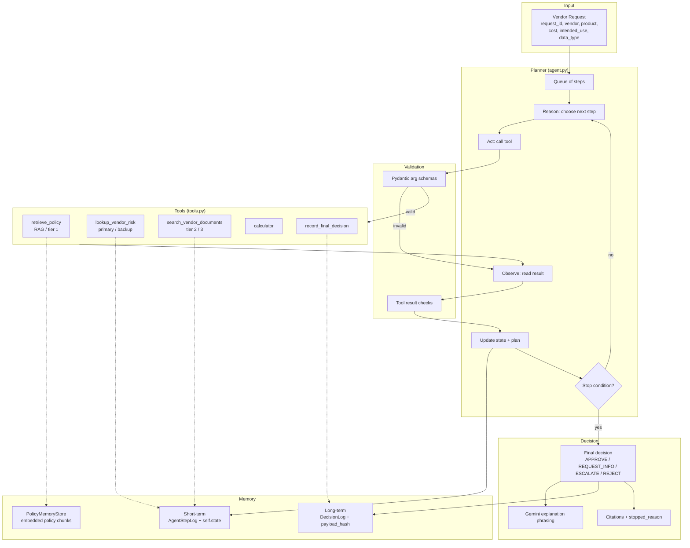
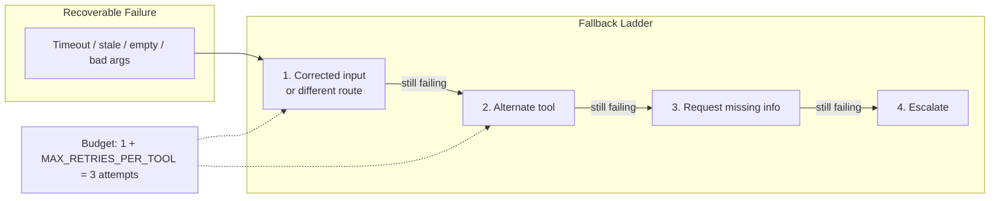
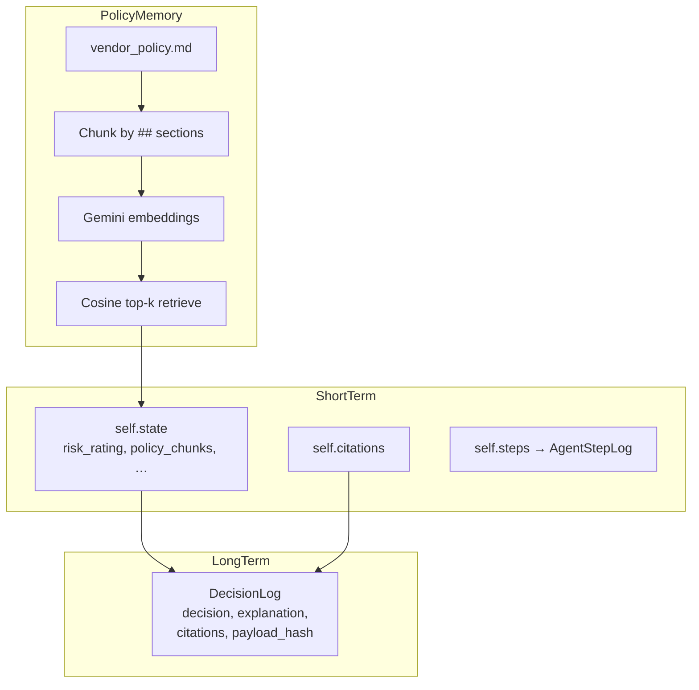

# Architecture Diagram

## High-level flow

## Planner / fallback detail

## Memory & provenance

## Decision authority tiers

| Tier | Source | Trust |
|------|--------|-------|
| 1 | Policy clauses (`retrieve_policy`) | Highest — always consulted first |
| 2 | Internal risk DB + approved security assessments | Trusted evidence |
| 3 | Vendor-supplied documents | Untrusted — logged via `guardrail_check`, never used as instructions |

Control flow only inspects structured fields (`result`, `risk_rating`, `document_date`, `authority_tier`). Free-text content from tier 3 is never parsed for commands.